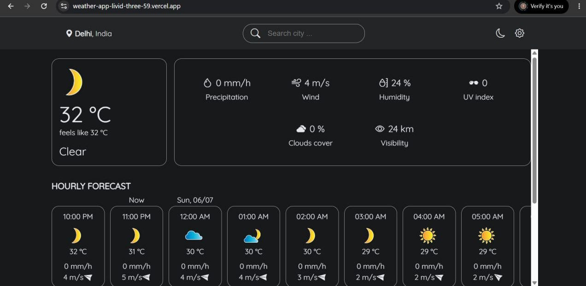
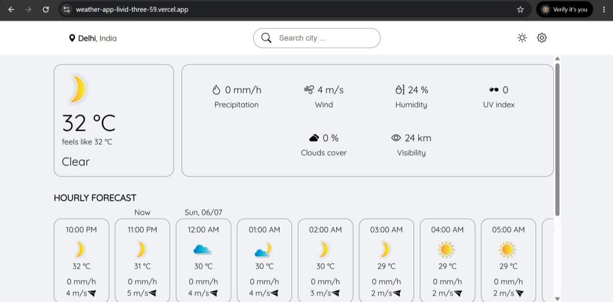
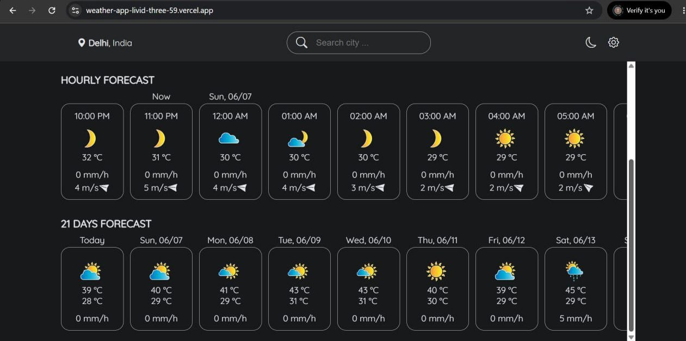
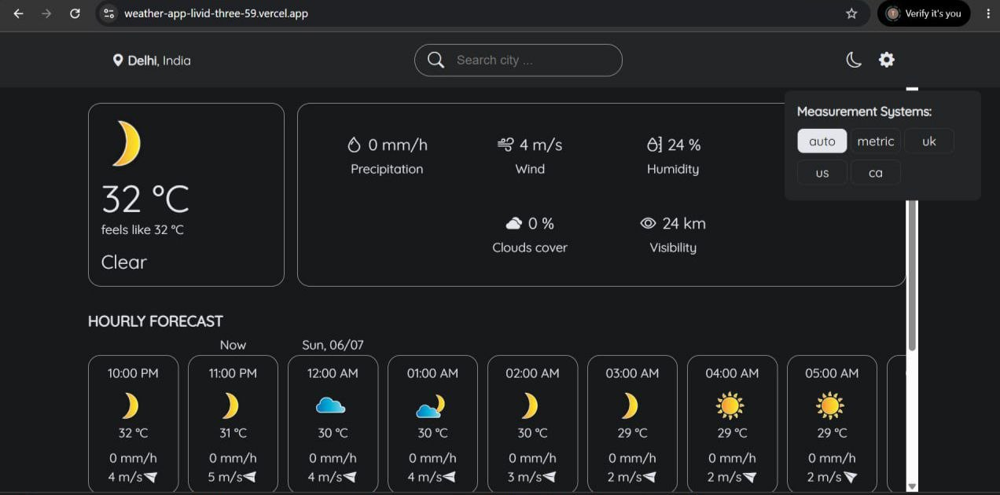

# 🌦️ React Weather App

A modern and responsive Weather Application built with **React.js** and **Scss**, powered by the **Meteosource Weather API**. The application provides real-time weather information, hourly forecasts, weekly forecasts, theme customization, and regional unit system support.

---

## 🚀 Features

### 🌍 Weather Information

* Search weather by city
* Real-time weather updates
* Current temperature display
* Weather conditions and icons
* Humidity information
* Wind speed details
* Atmospheric pressure data

### ⏰ Forecasts

* Hourly weather forecast
* Weekly weather forecast
* Scrollable forecast cards
* Detailed weather predictions

### 🎨 Customization

* Light and Dark theme support
* Dynamic UI updates
* Responsive design for desktop, tablet, and mobile devices

### 🌡️ Regional Unit Systems

* Automatic unit selection
* Metric System
* US System
* UK System
* Canada System
* Dynamic weather data conversion based on selected region

### 🌍 Localization

* Region-aware weather presentation
* Country-specific measurement units
* Improved user experience across different regions

### ⚡ User Experience

* Loading animations
* Error handling for invalid searches
* Smooth user interactions
* Modern and clean interface

---

## 🛠️ Tech Stack

### Frontend

* React.js
* JavaScript (ES6+)
* Sass (SCSS)

### API

* Meteosource Weather API

### State Management

* React Context API

---

## 📂 Project Structure

```bash
src/
│
├── api/
│   ├── current-weather.json
│   ├── daily-forecast.json
│   └── hourly-forecast.json
│
├── components/
│   ├── CurrentWeather.js
│   ├── DailyForecastWidget.js
│   ├── Forecast.js
│   ├── Header.js
│   ├── HorizontallyScrollable.js
│   ├── HourlyForecastWidget.js
│   └── Loader.js
│
├── constants/
│
├── context/
│   ├── theme.context.js
│   └── weather.context.js
│
├── styles/
│   ├── base/
│   ├── components/
│   ├── themes/
│   └── variables/
│
├── App.js
└── index.js
```

---

## 📸 Screenshots

### 🏠 Home Page

```md

```

### 🎨 Theme Switching

```md

```

### ⏰ Hourly & Weekly Forecast

```md

```

### 🌡️ Regional Unit Systems

```md

```


---

## ⚙️ Installation

Clone the repository:

```bash
git clone https://github.com/parth0811/react-weather-app.git
```

Navigate to the project directory:

```bash
cd react-weather-app
```

Install dependencies:

```bash
npm install
```

Configure your Meteosource API key:

```env
REACT_APP_METEOSOURCE_API_KEY=YOUR_API_KEY
```

Start the development server:

```bash
npm start
```

Open:

```text
http://localhost:3000
```

---

## 🌐 API Integration

This application uses the Meteosource Weather API to fetch:

* Current weather data
* Hourly forecasts
* Daily forecasts
* Temperature information
* Humidity levels
* Wind speed data
* Atmospheric pressure
* Weather condition icons

---

## 📚 Concepts Practiced

* React Components
* React Context API
* State Management
* API Integration
* Asynchronous JavaScript
* Responsive Design
* Sass Architecture
* Theme Management
* Conditional Rendering
* Error Handling
* Weather Data Processing

---

## 🔮 Future Improvements

* Geolocation-based weather
* Air Quality Index (AQI)
* Weather alerts and notifications
* Favorite cities feature
* Progressive Web App (PWA)
* Multi-language support
* Interactive weather maps

---

## 👨‍💻 Author

**Parth Girdhar**

* MERN Stack Developer
* Frontend Developer
* React Enthusiast

LinkedIn:
https://www.linkedin.com/in/parth-girdhar0811/

---

## 📜 License

This project is licensed under the MIT License.
